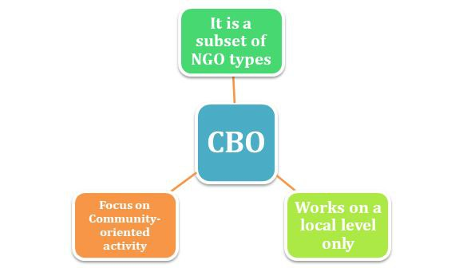

# Organisation-or-Organization
Organization or Organisation,is an entity such as a company,an institution,or an association comprising of one or more people and having a particular purpose.
# types of organization
- line organization
- line and staff organization
- Functional organization
- Divisional organization
- project organization
- matrix organization
- committee organization 

**My major emphasis in this repository is to look at the sub set of an NGO**,and that is **Community based organizations** **(CBOS)**
# community based organizations **(CBOS)**

